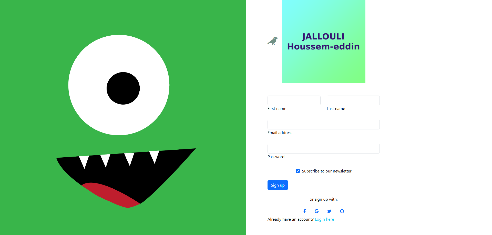
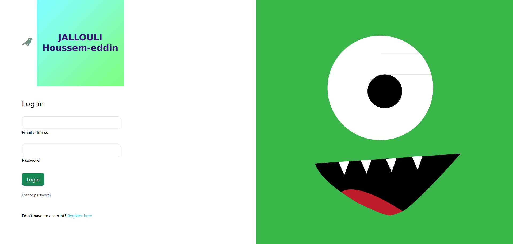
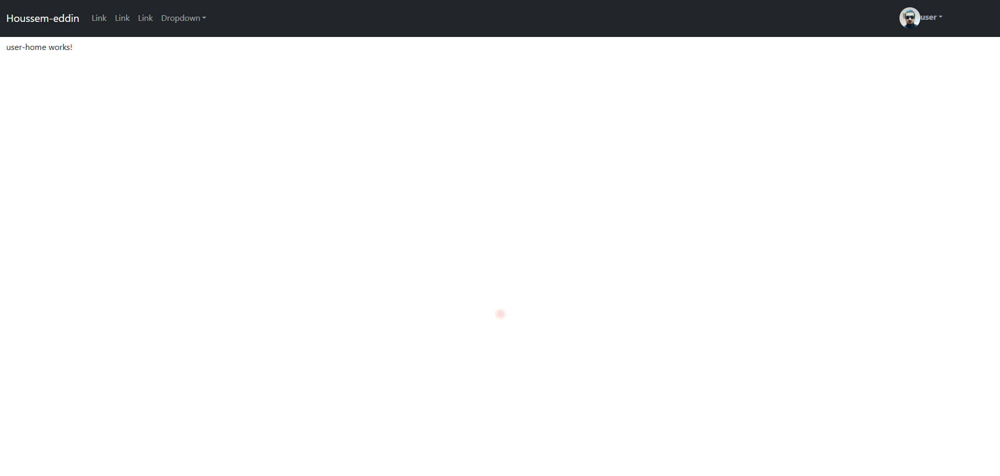
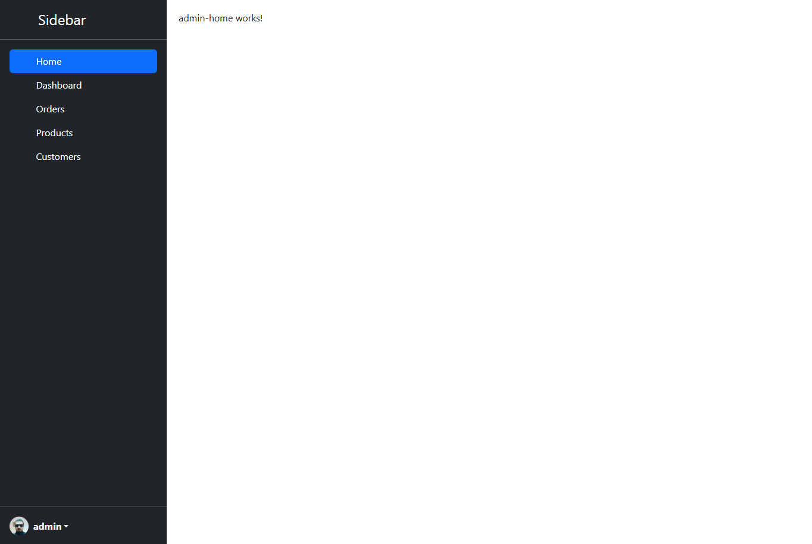

# spring-angular-random-app
 everything everywhere all at once


# Spring Boot 3 + Spring Security 6 - JWT Template

This project is a simple template for building a secure application with authentication and authorization via JWT (JSON Web Tokens). It uses the following technologies:

- **Backend**: Spring Boot 3 + Spring Security 6 (JWT)
- **Frontend**: Angular (version 19)
- **Database**: MySQL

## Features

- **Authentication & Authorization** using JWT.
- **Frontend**: An Angular application where users can sign in and sign up.
- **Backend**: A Spring Boot API that handles user management (signing up, logging in) and role-based access control.

## Setup Instructions

1. **Clone this repository**: (main branch)    
2. **Backend Setup**:
    
    - Ensure your MySQL database is running and properly configured.
    - **Run the backend**:
        - Install the dependencies using `mvn clean install`.
        - Start the Spring Boot application (`mvn spring-boot:run` or via your IDE).
    - **Default Admin Credentials**:
        - Email: `houssem`
        - Password: `houssem`
3. **Frontend Setup**:
    
    - Navigate to the frontend folder.
    - **Install dependencies**:
```
    npm install
```

- **Run the Angular app**:
        
```
        ng s -o
```

- The application will be available at `http://localhost:4200`.
4. **Authorization Configuration**:
    
    - After adding new controllers to the backend, update the **SecurityConfiguration** class in the `config` package to ensure the appropriate authorization:
        
```
        @Bean  
public SecurityFilterChain securityFilterChain(HttpSecurity http) throws Exception {  
    return http.csrf().disable()  
            .authorizeHttpRequests()  
            .requestMatchers("/users/welcome", "/users/new", "/users/authentificate").permitAll()  
            .requestMatchers("/users/**").authenticated()  
            .and().sessionManagement()  
            .sessionCreationPolicy(SessionCreationPolicy.STATELESS)  
            .and().authenticationProvider(authenticationProvider())  
            .addFilterBefore(authenticationFilter, UsernamePasswordAuthenticationFilter.class)  
            .build();  
}
```

## Demonstration

- **Sign Up**: Use the `/signup` page to create a user. By default, the new user will have the role `ROLE_USER`.

- **Sign In**: Use the `/signin` page to log in. Based on your role (`ROLE_USER` or `ROLE_ADMIN`), you will be directed to the appropriate template:

    - **Role `ROLE_USER`**: Access the user template.
    
    - **Role `ROLE_ADMIN`**: Access the admin template.
    

Once logged in, you can log out at any time.


## Customization

This project is intended to be a template, so after running the application, you can modify the backend and frontend according to your needs.

- For new features, consider adding new controllers and update the security configuration accordingly.
- If you need additional roles or permissions, modify the `SecurityConfiguration` class to include them.

## Final Words

Don't forget to ⭐ **star** this project if you find it useful, and make sure to **[subscribe to my YouTube channel](https://www.youtube.com/@houssemjallouli6083)** for more content and tutorials!
Feel free to reach out to me if you have any questions or need further assistance(houssem-eddin.jallouli@esprit.tn). Happy coding!